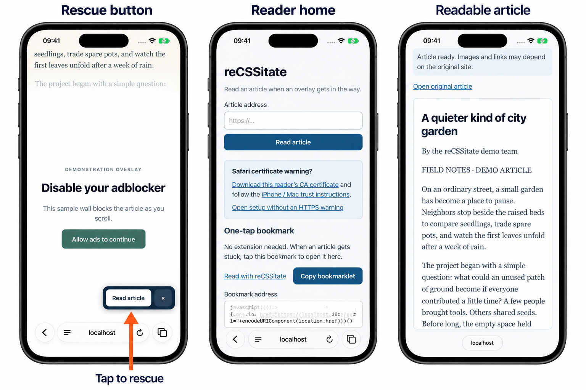

# reCSSitate

A small, self-hosted reader for articles obscured by anti-adblock overlays.
Choose a manual bookmarklet or an optional userscript that offers a **Read article**
button after a large anti-adblock wall persists. Both open the same reader.

The button sends only the article URL, after you tap. Ladder fetches a fresh copy,
using FlareSolverr for the configured sites. Mozilla Readability extracts the
article and DOMPurify sanitizes it into a sandboxed, script-free reading view.
It does not forward your publisher cookies or account. It cannot recover text a
publisher never serves, and it is not a universal paywall or CAPTCHA bypass.

## See it on iPhone

- **Rescue button:** a persistent wall triggers the button; tap **Read article**.
- **Reader home:** paste a URL, set up the bookmarklet or userscript, and install the CA.
- **Readable article:** scroll through a clean reading view, with a link back to the original.

Captured in Safari on an **iPhone 17 Pro simulator running iOS 27**, with device
frames and an arrow added for the overview. The article, wall and fetch response
are controlled demo fixtures; these images illustrate the UI, not publisher coverage.
Original full-resolution captures: [button](docs/assets/overview/01-rescue-button.png),
[home](docs/assets/overview/02-reader-home.png), [article](docs/assets/overview/03-reader-article.png).

## Quick start

The supplied deployment targets Linux x86_64 with Docker Compose. Run it on an
always-on server. Four pinned containers provide Caddy, Ladder, FlareSolverr and
an outbound Squid proxy. Reserve approximately 3 GB RAM for the stack.

1. Clone this repository. Copy `deploy/.env.example` to `deploy/.env`.
2. Set `READER_HOST` to the server's hostname or IPv4 address and `BIND_ADDRESS`
   to its LAN address. The default binds only localhost.
3. Authentication defaults to off (`READER_AUTH_ENABLED=false`). To require a
   login, set it to `true`, generate a bcrypt hash with `htpasswd -nB reader`,
   and copy the hash after `reader:` into `READER_PASSWORD_HASH`, preserving
   the single quotes. Keep `.env` private and save the password in your vault.
4. Create `deploy/sites.txt` with your chosen DNS hostnames, one per line.
   Run `python3 tools/configure.py --origin https://YOUR-HOST:8446 --sites deploy/sites.txt`.
   The site list and generated environment file are local and Git-ignored.
5. Run `docker compose --project-directory deploy config --quiet`, then
   `docker compose --project-directory deploy up -d`.
6. In Safari, open `http://YOUR-HOST:8086/` for the illustrated certificate setup.
   Tap **Download this reader’s CA certificate**, or open the direct link
   `http://YOUR-HOST:8086/reader-ca.crt`. Install the profile, then enable full trust
   in Settings → General → About → Certificate Trust Settings.
   Confirm the CA fingerprint with your administrator through a trusted channel.
   The [iPhone guide](docs/IOS-CERTIFICATE.md) covers every step. On macOS,
   follow [Import and trust the CA in Keychain Access](docs/MACOS-CERTIFICATE.md).
7. Open `https://YOUR-HOST:8446` and paste an article URL. If authentication is
   enabled, select **Sign in to the reader** and use the `reader` account.

To change authentication later, update `deploy/.env` and run
`docker compose --project-directory deploy up -d --force-recreate gateway`.
The sign-in link follows the gateway's setting. Enabling authentication requires
a valid password hash; invalid settings stop the gateway from starting.

The reader’s landing page includes the certificate download and setup links.
They use your deployment’s `READER_HOST`; GitHub cannot know your private address.
HTTP port 8086 serves only setup and the public CA, before HTTPS is trusted.
Set `READER_SETUP_PORT` to choose a different setup port.

Use an existing trusted certificate instead of Caddy's local CA when appropriate.
Never distribute the CA private key. Keep this service on your private network.
The sample deployment does not configure a router or expose itself to the Internet.

## Certificate setup on a Mac

Follow [the macOS certificate guide](docs/MACOS-CERTIFICATE.md) to download the
public CA, import it into Keychain Access, enable trust and verify Safari. The
reader’s setup page also has a **Mac instructions** section.

## On iPhone and iPad

If Safari shows a certificate warning for your local reader, complete the
[certificate installation and trust guide](docs/IOS-CERTIFICATE.md) first.

**Bookmarklet:** open the reader's landing page and tap **Copy bookmarklet**.
Bookmark the page in Safari, then edit the bookmark and replace its address with
that code. Name it “reCSSitate”. When a news page becomes unreadable, select the
bookmark. This requires a tap on each article and cannot automatically watch
future pages.

**Automatic button:** install [Userscripts for Safari](https://github.com/quoid/userscripts),
enable it in Safari's extension settings, and permit it on the news sites you
read. Open **Install reCSSitate userscript** on the reader's landing page, then use
the Userscripts extension menu to install it. The script uses only the manager's
storage APIs. An unconfigured copy asks for your reader server when first tapped.

See the [illustrated iPhone installation guide](docs/IOS.md) for the four taps
from the script page to the installed confirmation.

The detector checks for article text, an anti-adblock message, a large visible
obstruction, and persistence for 2.5 seconds. Small support notices and cookie
consent dialogs are intentionally left alone. It may miss unfamiliar markup or
walls that remove the article entirely; use the bookmarklet then. The × dismisses
the button for that page visit. Navigation uses the same tab, preserving Back.

## Sites and operation

The public `deploy/rules.default.yaml` applies the same solver and request settings
to every hostname. Ladder uses suffix matching, and an empty suffix is its
catch-all: no publisher names, encoded lists or publisher-specific partial matches
are needed. The userscript also detects obstruction behavior rather than hostnames.
This gives every configured site the same integration, including previously tested
sites and others with similar overlays; success still depends on returned content.

Fetch access is separate from matching. Each administrator supplies a private
`deploy/sites.txt`; the setup tool generates its allowlist, adding `www` aliases
to entries without that prefix. This prevents turning a reader into an unrestricted
fetch service. Adding a site requires no change to the public matching rule.

To change sites, edit the private list, rerun the setup command, then run
`docker compose --project-directory deploy up -d --force-recreate ladder`.
An empty list is rejected, and Compose requires the generated environment file.
Never commit generated configuration or enable arbitrary destinations.

Only Caddy publishes host ports (HTTPS reader and HTTP certificate setup).
Fetchers use an internal Docker network and
Squid denies private/nonpublic destination addresses and unsafe ports. The API
supports optional authentication, limits request size, and strips reader credentials
before forwarding requests to Ladder. Article URLs travel in the browser's URL
fragment and POST body. This is not an anonymity service: publishers and image
hosts still observe network requests, and browser history retains source URLs.

The rendered article cannot execute publisher scripts. Images may load from the
publisher; formatting, interactive embeds and some links may be lost. No archive
history or permanent article cache is maintained. FlareSolverr uses a server-side
Chromium identity, even when the reader is opened on an iPhone.

Ladder v0.0.23 uses FlareSolverr's cookies and then performs its own fetch; it does
not render FlareSolverr's returned HTML. The configured User-Agent matches the
pinned solver image. Recheck this pairing when upgrading images. Some challenge
systems bind clearance to additional browser characteristics and will still fail.

## Development and evidence

Run `npm ci`, `npx playwright install webkit`, then `npm test`. Run `python3 -m unittest discover -s tests -p '*_test.py'`
for the private configuration generator. On a Linux Docker host, run
`python3 tests/certificate_gateway.py` to verify the actual Caddy download, TLS
chain, setup-only HTTP routes and optional authentication. Also run
`python3 tests/generic_integration.py` to verify the catch-all rule using the
actual pinned Ladder image and an isolated synthetic solver/article fixture. Tests use synthetic
articles and cover negative detections, persistent walls, removal and navigation.
See [VALIDATION.md](VALIDATION.md) for live and native iOS results and limitations.
Do not commit credentials, captured articles, deployment addresses or browser profiles.

Own integration code is MIT licensed. Dependencies retain their own licences;
see [THIRD-PARTY.md](THIRD-PARTY.md). This project does not modify or redistribute
Ladder or FlareSolverr binaries; Compose pulls their upstream images.
