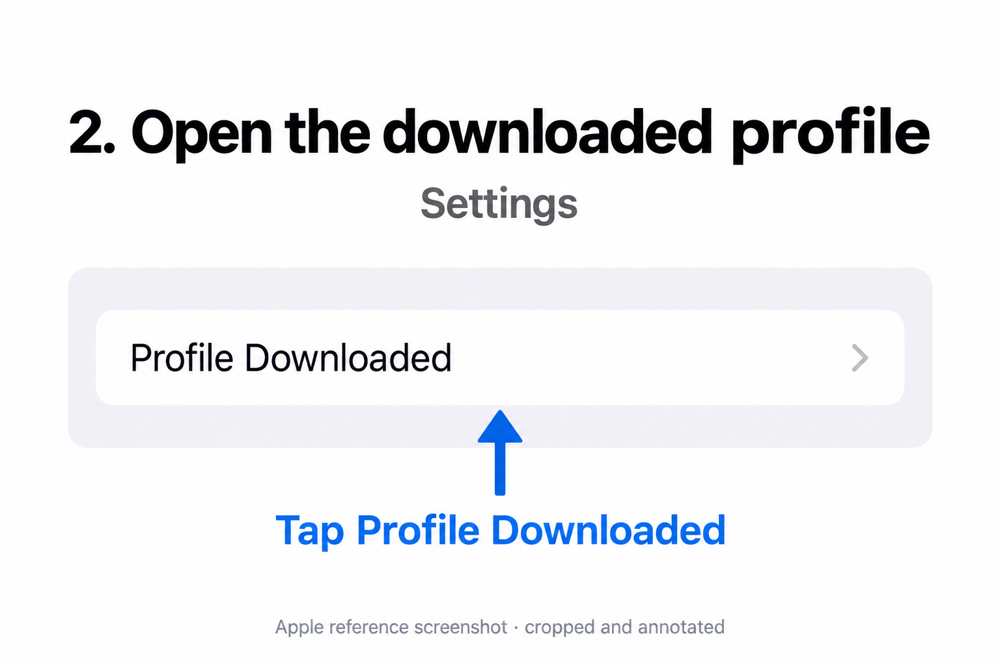
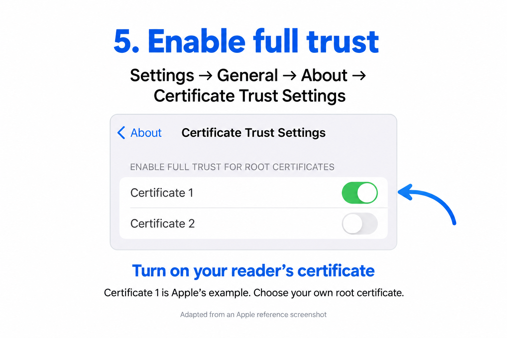

# Trust your reader's certificate on iPhone

Use this guide when your reader uses Caddy's local certificate authority and
Safari warns that the connection is not private. Installing the certificate and
enabling SSL/TLS trust are **two separate steps**. Do this once on each device.
If your reader already uses a publicly trusted certificate, skip this guide.

The two annotated reference images below are adapted from Apple's published
screenshots. They illustrate the relevant controls in an older iOS layout;
they are **not captures of iOS 27**. Account information has been removed, and
no deployment addresses or real certificate details are included.

You need the **public root CA certificate** and the HTTPS reader address from
the person who runs your server. Ask them to confirm the certificate's name and
SHA-256 fingerprint before trusting it. A trusted root can validate certificates
for other sites too; install only your own administrator's certificate.

## 1. Download the certificate in Safari

Connect to the network where your reader is hosted. Open your administrator's
certificate download link in the **Safari app**. Tap **Allow** when iOS asks to
download a configuration profile, then **Close** on the **Profile Downloaded**
message. This downloads the certificate; it does not install it yet.

The download address and reader address may be different. Use the links your
administrator provides. Do not install an example certificate from a tutorial.

## 2. Open the downloaded profile in Settings

Open **Settings**, then tap **Profile Downloaded** near the top. If that shortcut
is absent, look under **General → VPN & Device Management** and select the
downloaded profile.



Install promptly: iOS removes a downloaded profile after eight minutes if you
have not installed it. If it disappeared, download it again.

## 3. Review and install

Check that the profile contains the certificate your administrator provided.
Use **More Details** to inspect the certificate if needed. Tap **Install** in
the top-right corner and enter your **iPhone unlock passcode** if prompted.
This is not the reader's password.

Review the root-certificate warning, tap **Install** to confirm, and tap **Done**
when installation finishes. A local root may be described as not verified before
you trust it; confirm its identity with your administrator rather than trusting
an unfamiliar profile.

## 4. Find Certificate Trust Settings

In **Settings**, go to **General → About**, scroll to the bottom, then tap
**Certificate Trust Settings**.

## 5. Enable full trust

Under **Enable Full Trust for Root Certificates**, turn on the switch for your
reader's root certificate. Confirm the **Root Certificate** warning with
**Continue**. Leave unrelated certificates alone.



Caddy's default name commonly starts with **Caddy Local Authority**; your
administrator may have chosen another name. If the certificate does not appear,
finish installing its profile in steps 2–3 first.

## 6. Reopen the reader

Return to Safari and reopen your reader's **HTTPS** address. The certificate
warning should be gone. Choose **Sign in to the reader** and enter the reader
username and password supplied by your administrator.

If a warning remains, verify that full trust is enabled and that you opened the
exact hostname or IP address covered by the server certificate. Also check the
device's date and time. A name mismatch or expired certificate needs a server
fix; repeatedly dismissing Safari's warning does not fix it.

## For the server administrator

Export Caddy's **public** root certificate from the deployment:

```sh
docker compose --project-directory deploy cp \
  gateway:/data/caddy/pki/authorities/local/root.crt ./reader-ca.crt
openssl x509 -in reader-ca.crt -noout -subject -fingerprint -sha256
```

Give users the certificate and its fingerprint through your trusted setup
channel. If serving the download, use `application/x-x509-ca-cert` as its content
type. Never distribute `root.key`, credentials, or the entire Caddy data volume.
The sample Compose deployment does not provide a certificate download server.

If you replace the CA, devices will need to install and trust the new root.
To remove an old certificate, open **Settings → General → VPN & Device
Management**, select its profile, and tap **Remove Profile**.

## Apple references

- [Install a configuration profile](https://support.apple.com/en-ae/102400)
- [Trust a manually installed certificate](https://support.apple.com/en-ie/102390)

The illustrations are cropped and annotated adaptations of the screenshots in
these Apple articles, with account details omitted. Apple's interface images
remain Apple's property and are not covered by this project's MIT licence.
Screen wording and layout can vary by iOS version.
