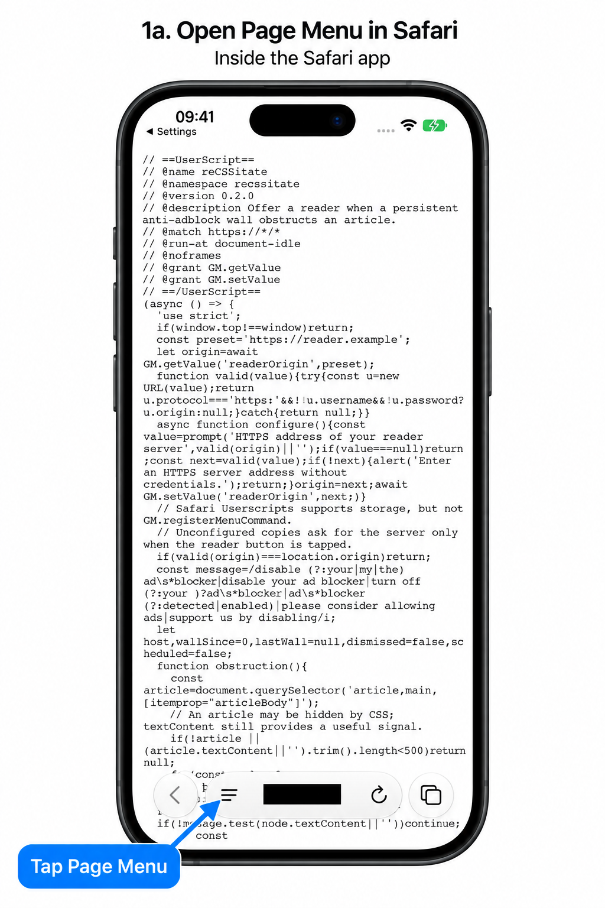
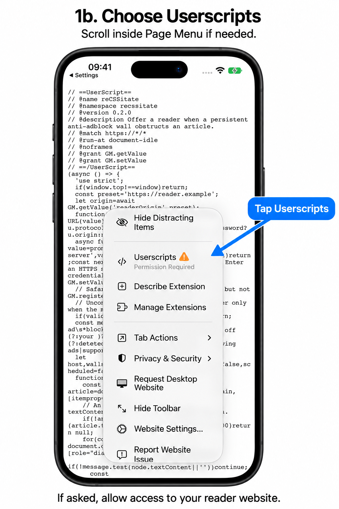
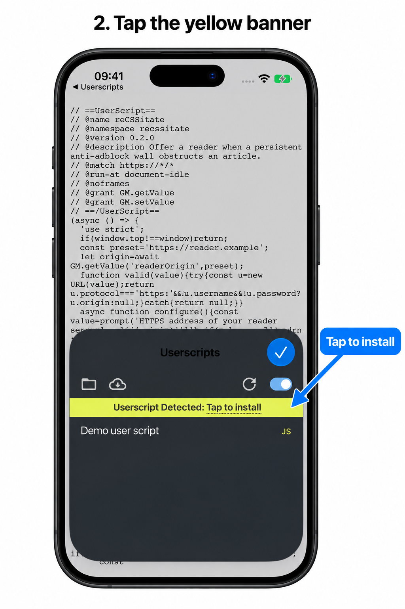
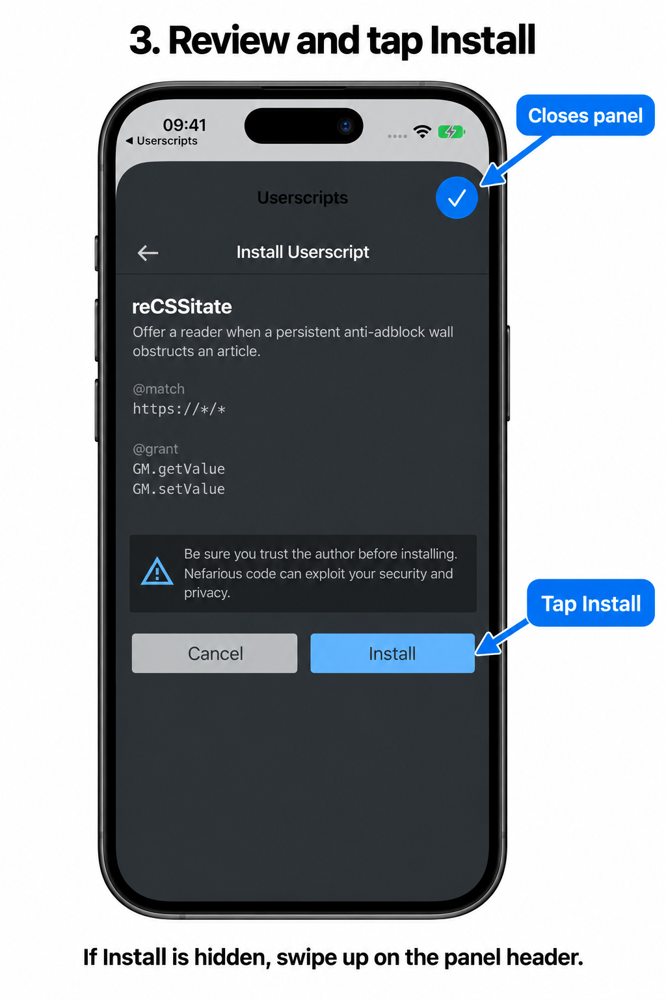
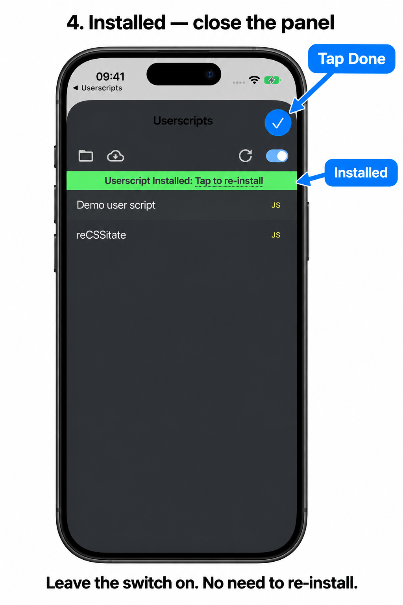

# Install reCSSitate in Safari on iPhone

If Safari warns about your reader's certificate, first follow the
[iPhone certificate installation and trust guide](IOS-CERTIFICATE.md).

After installing the [Userscripts app](https://github.com/quoid/userscripts),
open it once to initialize its scripts folder. Enable its Safari extension and
allow access to your reader server and the sites where you want the rescue
button. Open your reader's landing page in Safari and tap **Install reCSSitate
userscript**. Seeing JavaScript source is expected.

## 1. Open Page Menu inside Safari (iOS 27)

Keep the script page open in the **Safari app**. Tap the **Page Menu** button
on the **left side of the address/search field**: three horizontal lines with
a shorter bottom line. Then choose **Userscripts** from that menu.

The address field may be at the top or bottom depending on your Safari layout.
If the toolbar is hidden, tap the bottom of the screen to reveal it.

Scroll **inside Page Menu** if Userscripts is not visible. If it says
**Permission Required**, tap it, choose **Always Allow…**, then
**Always Allow on This Website** to grant access to your reader. Open Userscripts
again if Safari closes the menu after granting access.

## 2. Tap the yellow install banner

In the Userscripts popup, tap **Userscript Detected: Tap to install**.

## 3. Confirm Install

Check that the script is **reCSSitate**, review its details, and tap the blue
**Install** button below the warning. If the button is cut off, **swipe up on
the Userscripts panel header** to expand it, as shown below.
The checkmark at the top closes the popup; it is not the Install button.

## 4. Check the green confirmation

The banner changes to **Userscript Installed: Tap to re-install**. Installation
is complete; you do not need to tap the banner again. Leave the extension's switch
on and tap the blue checkmark to close the popup.

Return to an article and reload it if it was already open. reCSSitate offers
**Read article** when it detects a persistent large anti-adblock obstruction.
A readable page will not show the button. If Safari asks for website access,
grant access on the sites where you want the script to run.

If no yellow banner appears, make sure Safari is showing the `.user.js` link
from your own reader server and Userscripts has access to that server.

These images use full-screen captures from a clean **iPhone 17 Pro simulator
running iOS 27**, with device frames and annotations added. Userscripts was built
from its stable release source (iOS 1.8.6). Addresses are blacked out, and the
script uses a fictional example server. Layout may vary by iOS and Userscripts
version.

The iOS 27 Page Menu icon and its location were checked against
[Apple’s iOS 27 Safari guide](https://support.apple.com/guide/iphone/customize-your-safari-settings-iphb3100d149/27/ios/27).
